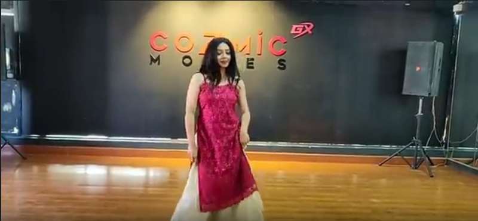
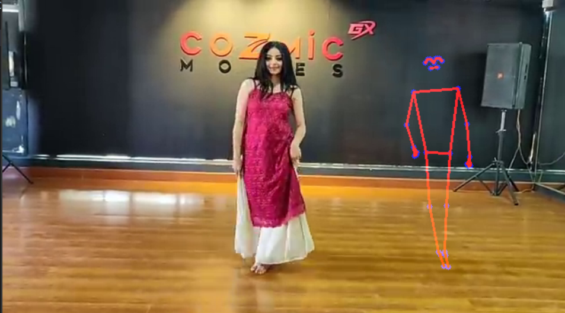

# Dance Companion


A computer vision–powered tool that lets solo dancers visualize their movements side by side with a mirrored pose overlay. Upload any dance video (or use webcam), and Dance Companion detects body landmarks, flips them, and displays both original and mirrored skeletons for direct comparison and self‑correction.

- - -

## Table of Contents

* [Features](#features)
* [Demo](#demo)
* [Installation](#installation)
* [Usage](#usage)
* [Configuration](#configuration)
* [Sample Input & Output](#sample-input--output)
* [Contributing](#contributing)
* [License](#license)
* [Future Improvements](#future-improvements)

- - -

## Features

* **Real‑Time Pose Detection**: 33 key landmarks at up to 30 FPS using MediaPipe Pose.
* **Mirrored Overlay**: Flips detected landmarks horizontally with adjustable `offset_x`.
* **Customizable Visualization**: Change landmark colors, circle radius, and connection thickness.
* **File & Webcam Support**: Process prerecorded MP4 files or live video streams.
* **Lightweight & Extensible**: Built on OpenCV and MediaPipe; easy to add scoring or angle calculations.

- - -

## Demo


- - -

## Installation

1. **Clone the repo**

``` bash
git clone https://github.com/yourusername/dance-companion.git
cd dance-companion
```

2. **Create a virtual environment**

``` bash
python3 -m venv venv
source venv/bin/activate   # Linux/Mac
venv\Scripts\activate    # Windows
```

3. **Install dependencies**

``` bash
pip install -r requirements.txt
```

*Requirements (`requirements.txt`)*:

``` text
opencv-python>=4.0.0
mediapipe>=0.8.0
numpy>=1.18.0
```

- - -

## Usage

### Process a Video File

``` bash
python dance_companion.py --input path/to/video.mp4 --offset 150 --radius 3 --thickness 2
```

### Live Webcam Mode

``` bash
python dance_companion.py --webcam 0 --offset 100
```

| Argument | Description | Default |
| -------- | ----------- | ------- |
| `--input` | Path to video file (MP4) | -- |
| `--webcam` | Webcam device index (0,1,…) | -- |
| `--offset` | Horizontal offset for mirrored overlay | 150 |
| `--radius` | Radius of landmark circles (pixels) | 3 |
| `--thickness` | Thickness of connection lines (pixels) | 2 |

- - -

## Sample Input & Output

   

In the composite view, the left side shows the raw video and the right side shows the mirrored skeleton in real time.

- - -

## Contributing

Contributions are welcome! Please follow these steps:

1. Fork the repository.
2. Create a feature branch: `git checkout -b feature/YourFeature`
3. Commit your changes: `git commit -m "Add YourFeature"`
4. Push to the branch: `git push origin feature/YourFeature`
5. Open a pull request.

Please ensure code style consistency and include tests for new features.